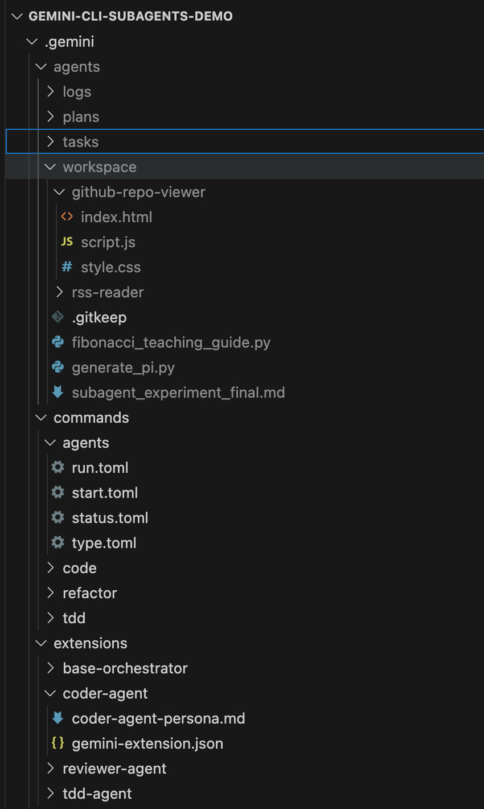
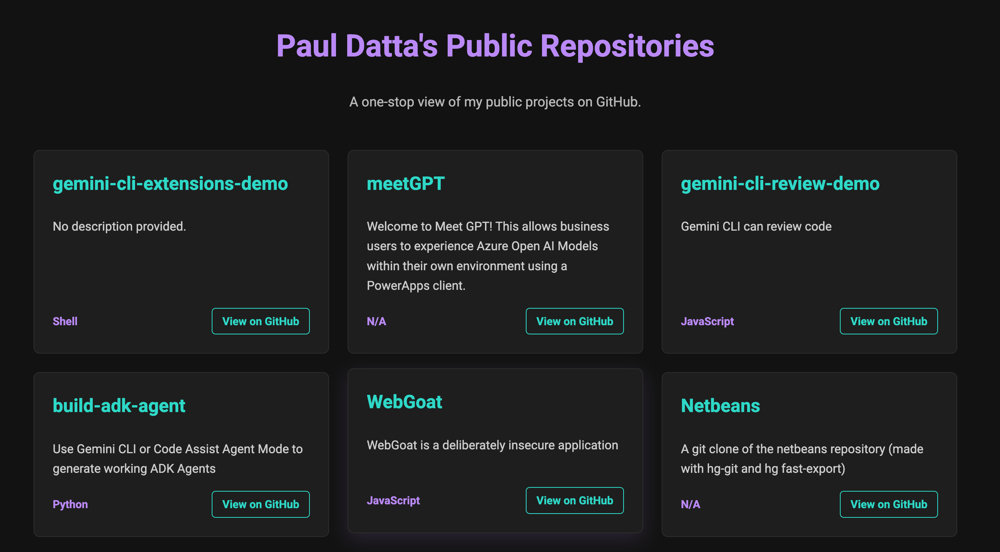

# Gemini CLI: Prompt-Driven Sub-Agent Orchestrator

This project is a proof-of-concept demonstrating a sub-agent orchestration system built entirely within the Gemini CLI using its native features. It uses a filesystem-as-state architecture, managed by a suite of prompt-driven custom commands, to orchestrate complex, asynchronous tasks performed by specialized AI agents.

## Core Concepts

1.  **Filesystem-as-State**: The entire state of the system (task queue, plans, logs) is stored in structured directories on the filesystem, making it transparent and easily debuggable. There are no external databases or process managers.

2.  **Prompt-Driven Commands**: The logic for the orchestrator is not written in a traditional programming language. Instead, it's defined in a series of prompts within `.toml` files, which create new, project-specific commands in the Gemini CLI (e.g., `/agents:start`).

3.  **Asynchronous Agents**: Sub-agents are launched as background processes. The orchestrator tracks them via their Process ID (PID) and reconciles their status by checking for a sentinel `.done` file upon their completion.

## Architecture

-   **Orchestrator**: A set of custom Gemini CLI commands (`/agents:*`) that manage the entire lifecycle of agent tasks, from creation to completion.
-   **Sub-Agents**: Specialized Gemini CLI extensions, each with a unique persona and a constrained set of capabilities (e.g., `coder-agent`, `reviewer-agent`).

## Directory Structure

The entire system is contained within the `.gemini/` directory. This image shows the structure of the `agents` and `commands` directories that power the system.



-   `agents/`: Contains the definitions for the sub-agents and the workspace where they operate.
    -   `tasks/`: Contains the JSON state files for each task and `.done` sentinel files.
    -   `plans/`: Holds Markdown files for agents' long-term planning.
    -   `logs/`: Stores the output logs from each agent's background process.
    -   `workspace/`: A dedicated directory where agents can create and modify files.
-   `commands/`: Contains the `.toml` files that define the custom `/agents` commands.

## Commands

-   `/agents:start <agent_name> "<prompt>"`: Queues a new task by creating a JSON file in the `tasks` directory.
-   `/agents:run`: Executes the oldest pending task by launching the corresponding agent as a background process.
-   `/agents:status`: Reports the status of all tasks. It first reconciles any completed tasks by checking for `.done` files.
-   `/agents:type`: Lists the available agent extensions.

## Example Workflow

1.  **Queue a Task**:
    ```bash
    gemini /agents:start coder-agent "in a folder, use html/css/js (nicely designed) to build an app that looks at github.com/pauldatta and is a one-stop view of the repos and what they have been built for (public repos)"
    ```
    **Output**: `Task task_20250726T183100Z created for agent 'coder-agent' and is now pending.`

2.  **Run the Orchestrator**:
    ```bash
    gemini /agents:run
    ```
    **Output**: `Orchestrator started task task_20250726T183100Z (PID: 13539) in the background.`

3.  **Check the Status (While Running)**:
    ```bash
    gemini /agents:status
    ```
    **Output**:
    | Task ID | Agent | Status | Created At | PID | Prompt |
    |---|---|---|---|---|---|
    | task_20250726T183100Z | coder-agent | running | 2025-07-26T18:31:00Z | 13539 | in a folder, use html/css/js... |

4.  **Check the Status (After Completion)**:
    After the agent is finished, the next run of `/agents:status` will first reconcile the task and then display the final state.
    ```bash
    gemini /agents:status
    ```
    **Output**:
    `Task task_20250726T183100Z has been marked as complete.`
    | Task ID | Agent | Status | Created At | PID | Prompt |
    |---|---|---|---|---|---|
    | task_20250726T183100Z | coder-agent | complete | 2025-07-26T18:31:00Z | 13539 | in a folder, use html/css/js... |

### Final Output

The `coder-agent` successfully creates a web application in the `.gemini/agents/workspace/github-repo-viewer` directory. Here is a screenshot of the final running application:



---

## Further Reading

-   **Blog Post**: [How I Turned Gemini CLI into a Multi-Agent System with Just Prompts](https://aipositive.substack.com/p/how-i-turned-gemini-cli-into-a-multi)
-   **Demo Video**: [See it in Action](https://aipositive.substack.com/i/169284045/see-it-in-action)

---

## Disclaimer

This project is a proof-of-concept experiment.

-   **Inspiration**: The core architecture is inspired by Anthropic's documentation on [Building a Sub-Agent with Claude](https://docs.anthropic.com/en/docs/claude-code/sub-agents).
-   **Roadmap**: A more robust and official agentic feature is on the [Gemini CLI roadmap](https://github.com/google-gemini/gemini-cli/issues/4168).
-   **Security**: This implementation is **not secure for production use**. It relies on the `-y` (`--yolo`) flag, which bypasses important security checks. For any real-world application, you should enable features like checkpointing and sandboxing. For more information, please refer to the [official Gemini CLI documentation](https://github.com/google-gemini/gemini-cli/blob/main/docs/cli/commands.md).